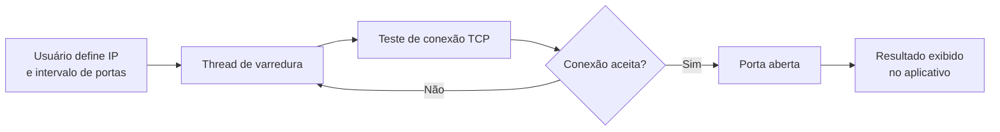

---

## 👋 Olá, eu sou Miguel Moraes

🎓 Estudante de **Ciência da Computação** na **UFAM/IComp**
🔬 Bolsista **PIBITI/CNPq** — Iniciação Científica em andamento
🛡️ Interesses em **Cibersegurança**, **Inteligência Artificial** e **Desenvolvimento de Software**
🏛️ Membro do **PET-Computação**
📍 Manaus — Amazonas — Brasil

---

## 🧠 Sobre mim

Sou estudante de Ciência da Computação na **Universidade Federal do Amazonas (UFAM)** e pesquisador bolsista pelo programa **PIBITI/CNPq**. Atuo no desenvolvimento de soluções nas áreas de segurança da informação e inteligência artificial, com experiência em monitoramento Red Team no **INDT (Instituto de Desenvolvimento Tecnológico)**.

Minhas principais áreas de interesse:

- 🔐 Segurança da Informação & Pentest
- 🤖 Inteligência Artificial & LLMs
- 🌐 Redes de Computadores
- ⚙️ Desenvolvimento de Software

---

## 🛠️ Tecnologias

  

---

## 📊 Distribuição por projeto

---

## 🚀 Projetos em Destaque

### 🔬 PonderSEC
> Plataforma web para **avaliação comparativa de LLMs em tarefas de cibersegurança**, desenvolvida durante a iniciação científica **PIBITI/CNPq**.

**Stack:** Python · Django · PostgreSQL · Docker

---

### 🔐 PIN Brute Force
> Implementação de ataque de **força bruta a PIN de 6 dígitos** com **paralelismo via pthreads em C**.

**Resultado:** tempo reduzido de **23 ms → 5,6 ms** com 4 threads (~4× de speedup)

---

### 📡 PortScanner Android
> Aplicativo Android em **Java** que realiza **varredura de portas TCP** em um host de rede via sockets em thread dedicada.

---

## 🌐 Contato

