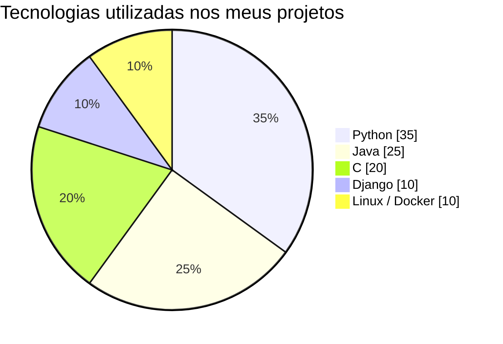
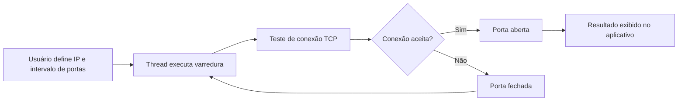

# 👋 Olá, eu sou Miguel Moraes

🎓 Estudante de **Ciência da Computação — UFAM**
🔬 **Bolsista de Iniciação Científica (PIBITI/CNPq)**
🛡️ Interesse em **Cibersegurança, Inteligência Artificial e Desenvolvimento de Software.**

📍 Manaus — Amazonas — Brasil

---

# 🧠 Sobre mim

Sou estudante de Ciência da Computação na **Universidade Federal do Amazonas (UFAM)** e membro do **PET Computação**.

Tenho interesse em pesquisa e desenvolvimento nas áreas de:

* Inteligência Artificial
* Segurança da Informação
* Sistemas e Redes
* Engenharia de Software

---

# 🛠️ Tecnologias

---

# 📊 Tecnologias Utilizadas

---

# 🚀 Projetos em Destaque

### 🔬 PonderSEC

Plataforma para **avaliação de LLMs em tarefas de cibersegurança**, desenvolvida durante minha **iniciação científica PIBITI/CNPq**.

Stack:
Python • Django • PostgreSQL • Docker

---

### 🔐 PIN Brute Force

Implementação de ataque de **força bruta a PIN de 6 dígitos** utilizando **paralelismo com pthreads em C**.

Tempo reduzido de:

**23ms → 5,6ms com 4 threads**

---

### 📡 PortScanner

Aplicativo Android desenvolvido em **Java** que realiza **varredura de portas TCP em um host de rede** utilizando **sockets e execução em thread**.

---

# 🌐 Contato

💼 LinkedIn
https://www.linkedin.com/in/miguel-moraes-7a2535309/

📧 Email
[miguelmoraess1212@gmail.com](mailto:miguelmoraess1212@gmail.com)

🐙 GitHub
https://github.com/miguelmoraesx

